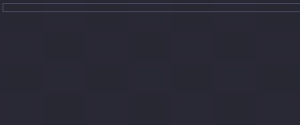
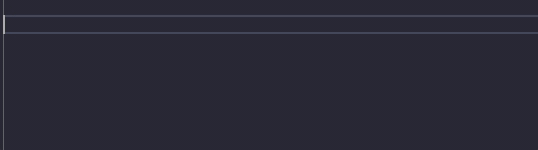

# React Snippets

A simple but powerful react typescript snippets extension

## Features

- `rcomp`: react typescript component
- `rcont`: react typescript component with children prop
- `rmap`: array map
- `ruef`: useEffect
- `rustate`: useState
- `rumemo`: useMemo
- `runmount`: useEffect with return function (unmount)

## Usage

1. Install the extension
2. Open a `.tsx` file and type one of the snippets above
3. You can use `tab` to navigate between fields
